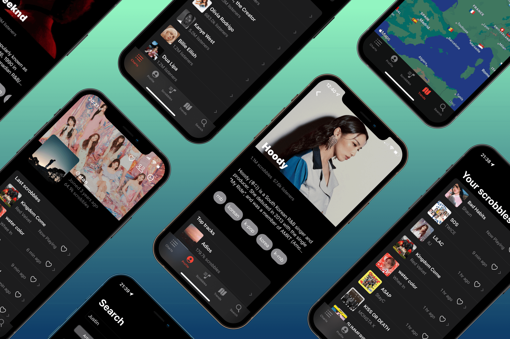

# first.fm - The alternative last.fm client for iOS


(_it's actually not available on the App Store... yet_)

## Features

- Your profile (top artists, tracks and albums, friends)
- Your last scrobbles
- Global charts (artists and tracks)
- Trends map (top artists per country)
- Search (artists, tracks and albums)

Features **not included**:

- Scrobbling. This app does not intend to be a scrobbler
- Reports (not available on the last.fm API 😔)

## How to run

### Requirements

- Xcode 12+
- Swift 5+

### API keys

Copy `firstfm/Config/Secrets.example.xcconfig` to `firstfm/Config/Secrets.xcconfig` and fill it:

```swift
SPOTIFY_API_TOKEN =
LASTFM_API_KEY =
LASTFM_API_SHARED_SECRET =
```

#### Last.fm API key

Get an API key by filling [this form](https://www.last.fm/api/account/create).

Fill `LASTFM_API_KEY` and `LASTFM_API_SHARED_SECRET` in `firstfm/Config/Secrets.xcconfig`.

#### Spotify API key

Create a Spotify app and get the keys on the [Spotify developer dashboard](https://developer.spotify.com/dashboard/applications).

Fill `SPOTIFY_API_TOKEN` in `firstfm/Config/Secrets.xcconfig`.

## Caveats and limitations

### Artworks

The last.fm API does not provide artworks [anymore](https://stackoverflow.com/a/59529682/6945353). Instead, it returns a default placeholder image. This is very inconvenient for us, but we have no choice to use another API.
To work around this limitation, the app uses the [Spotify Search API](https://developer.spotify.com/console/get-search-item/) to search for the entity (artist or album), and uses the images returned by Spotify. This means that:

- An extra call to the Spotify API has to be made for each entity displayed by the app (a list of 50 artists retrieved by a signel last.fm API call will be followed by 50 Spotify API calls). This is a waste of resources and make the whole app slower. Luckily, the app does not suffer much from this since the Spotify API is very fast, and caching + async mechanism are used.
- Artwork do not always match in cases of homonyms ☹️

### Listenings reports

The listening reports ([example](https://www.last.fm/user/stan__/listening-report/year)) which are accessible on the website and the official app are not available on the public API, so this isn't part of the app.

### Following/followers

On users profile, there are only "friends" (which seems to be followings). The last.fm API has not been updated to support concept of "following" or "followers", as on the website. Thus, you also can't follow or unfollow users.

### App Store availability

The app is not yet available on the App Store for a few reasons:

- It's not finished, there are still some missing views and bugs (see issues)
- The app icon uses the last.fm logo, which I'm pretty is not allowed + not a good idea
- I don't have a developer account ($$)
- The Spotify API has been working pretty well (for free!) but I don't know if publishing the app on the app store would break their terms
- (The name sucks... I think?)

## Libraries used

- [Cache](https://github.com/hyperoslo/Cache): memory/disk cache for Spotify Search API calls
- [CryptoSwift](https://github.com/krzyzanowskim/CryptoSwift): used for the md5 signature (🥲) for last.fm mutating API calls
- [FancyScollView](https://github.com/nerdsupremacist/FancyScrollView): stretchy header w/ school view (artist view)
- [Kingfisher](https://github.com/onevcat/Kingfisher): image handler with memory/disk cache
- [NotificationBanner](https://github.com/eenwak/NotificationBanner): nice errors banners
- [SwiftUIRefresh](https://github.com/timbersoftware/SwiftUIRefresh): pull to refresh (charts, scrobbles)
- [Valet](https://github.com/square/Valet.git): KeyChain wrapper to store LastFM user key


